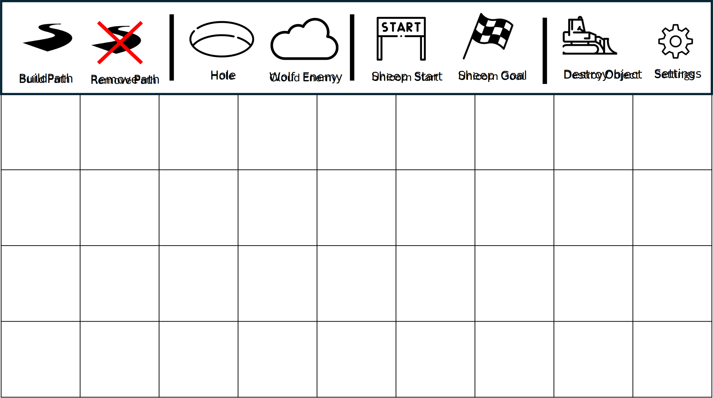

# Game Concept & Vision

## Project Vision (Summary for Managers)

The goal of the project is to develop a puzzle game inspired by the children's PC game **Ovečky** from the development team **Špidla Data Processing**. The game will prioritize simple controls, engaging mechanics, stability, and an object-oriented programming (OOP) structure of the source code. List of all of the planned features is below.

## Basic Gameplay

The player's objective is to guide as many **Unicorns** (based on sheep in *Ovečky*) to the goal while collecting all coins.

### Game Flow

-   The game consists of **~10 levels**.
-   Levels are **tile-based maps**.
-   NPCs move constantly across the tiles.
-   The player controls NPC movement using placeable **Arrows**.
-   Collecting all coins **unlocks the finish line**.
-   Level is completed by guiding a given minimum percentage of Unicorns to the finish.

## Planned Features

### NPCs

#### Unicorns (based on sheep in *Ovečky*)

-   Unless affected by arrow, moves constantly and upon hitting a wall turns left.
-   The player's goal is to guide them to the finish line.
-   They collect **coins**.
-   They follow arrow directions.
-   They **die** upon collision with **Clouds**.

#### Clouds (based on wolf in *Ovečky*)

-   They move similarly to Unicorns.
-   They cannot collect coins.
-   They **kill Unicorns** on collision.
-   They follow arrow directions.

### Arrows

-   Left mouse button **places an arrow** on an empty tile.
-   Left mouse button on an existing arrow **rotates it**.
-   Right mouse click **removes the arrow**.
-   Maximum **20 arrows** per level.
-   NPCs change direction based on arrow orientation.

### Items
The items are instantly consumed upon colliding with **Unicorns** and the effect lasts around **15 seconds.**

-   **Fire** - _Dries_ Clouds, stopping their movement.
-   **Rainbow** - Grants Unicorns the power to kill Clouds on collision (similar to Pac-Man cherries).

### GUI

-   **Menu** with Save/Load/Sound settings.
-   Game screen with timer and coin counter.
-   After launch user will be greeted with menu where he can select the profile or start the level editor. 

### Game Controlling

- **Mouse** only (placing tiles, clicking GUI buttons in menu)

### Assets

#### Visuals, Images

- Most visuals will be **hand-drawn**, then converted into digital form or created directly in digital format.
- This includes images of **NPCs**, **level backgrounds**, **paths**, **objects**, and **decorations**.
- The game will take place in the **sky**, with backgrounds depicting **sky/space** featuring **rain**, **stars**, **clouds**, **sun**, and **moon** as decorations.

#### Audio, Music

- Most audio will be sourced from the original game **Ovečky**, either directly or **remixed**.
- Additional music and SFX will be used from **non-copyrightable sources**.

### Additional Features

#### **Time limit** for each level
- Each level will be assigned a time limit based on testing playthroughs, approximately **150%** of the fastest completion time.
- Estimated time duration of level will range from **30 to 120 seconds**.

#### Simple **NPC movement animations**
- Animations will be hand-drawn, with around **10 unique bone movement animations**.
- Focus will be on **reusing animations** to minimize the number of required assets.
- Each entity will have its own movement animation.

#### **Built-in level editor**
- GUI-based screen with an **object selection bar** for placing tiles like paths, enemies, coins, start, and goal.
- Paths will be placed using **click-and-drag**, while objects will be placed by **clicking**.
- Objects can be removed using a **Destroy Object** tool.
- Settings will include the number of starting Unicorns, percentage of required Unicorns to complete the level, and time limit.
- The user can **save and load custom levels**.
- Pre-made levels will be created using the editor, allowing players to **modify story levels**.
- The editor will perform a **BFS check** to ensure the level is solvable before saving.

#### **Save/Load system** with multiple profiles
- Users can create an **unlimited number of profiles**.
- Each profile will display **basic stats** like collected coins and completed levels.
- The game will **automatically save progress** after each completed level.
- Data will be stored in **JSON format** in the game folder.

#### Option to **speed up or pause** the game
- Users can adjust the game speed to **0.5x, 1x, 2x, or 3x**.
- Speed adjustments will only affect **NPC movement**, not the time limit clock.
- Certain levels may require faster speeds to complete.
- The player can **pause the game**, stopping NPC movement and the time limit clock.
